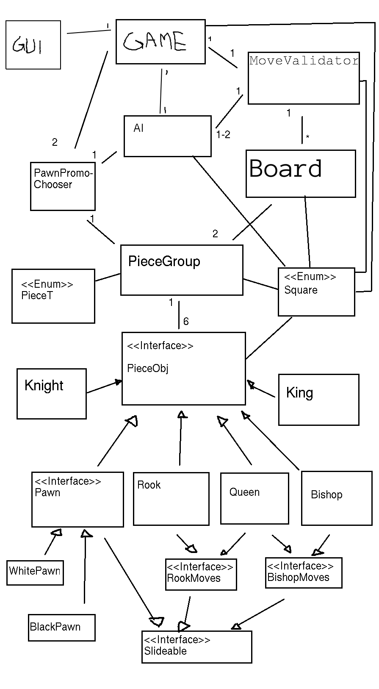

# Shakkiproggis

**Aihe:** Shakki lautapeli javalla. Ohjelmalla voi pelata shakkia tekoaälyä vastaan.

**Käyttäjät:** Pelaaja.

**Käyttäjien toiminnot:** Käyttäjät voivat siirtää omalla vuorollaan omia nappuloitaan sellaisiin paikkoihin pelilaudalla, mihin niitä sääntöjen mukaan saa siirtää. Jos pelaajia on vain yksi, ohjelma valitsee vastapelaajan siirrot arpomalla laillisten siirojen joukosta jonkin hyvän siirron.

**Luokkakaavio**

**OK siirto**

**Huono siirto**

